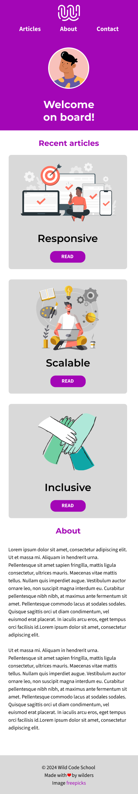
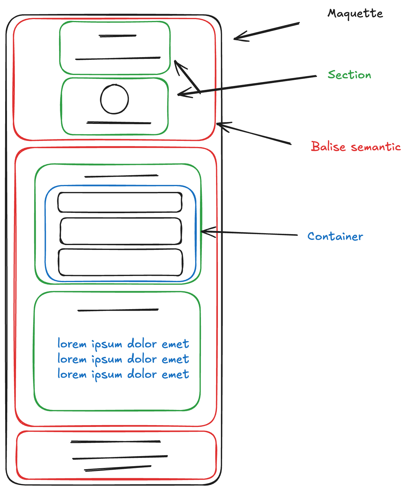

<h1 align="center">Bienvenue sur Bienvenue à bord 👋</h1>

  

## 🎯 La mission

Le but de ce projet et de manipuler les bases de l'HTML et du CSS pour créer une page web simple.

## 👀 Ce que je vois

## Auteur

👤 **Anthony Gorski**

-   🍱 : [Tous mes réseaux](https://bento.me/anthony-gorski)
-   𝕏 : [@Gorski_Anthony](https://twitter.com/Gorski_Anthony)
-   🐙 : [@GorskiAnthony](https://github.com/GorskiAnthony)

## Affichez votre soutien

## Donnez un ⭐️ si ce projet vous a aidé !

### 🗃️ Version

-   **v** - First commit

---

### 👋 Qui suis-je ?

Je suis **[Anthony Gorski](https://bento.me/anthony-gorski)**, un super développeur toujours à la recherche de challenge !
